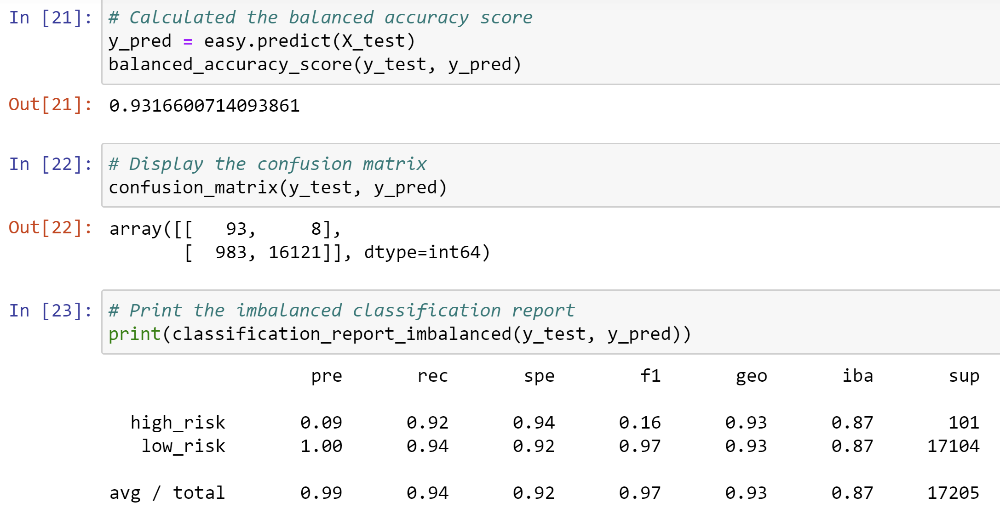

# Credit Risk Analysis
## Overview
Credit risk is an inherently unbalanced classification problem, as good loans easily outnumber risky loans. In this analysis, different techniques have been applied to train and evaluate models with unbalanced classes. Imbalanced-learn and scikit-learn libraries have been used to build and evaluate models using resampling.

The credit card credit dataset from LendingClub, a peer-to-peer lending services company, has been used to oversample the data using the RandomOverSampler and SMOTE algorithms, and undersample the data using the ClusterCentroids algorithm. Then a combinatorial approach of over- and undersampling using the SMOTEENN algorithm was utilized.  Finally, two new machine learning models that reduce bias, BalancedRandomForestClassifier and EasyEnsembleClassifier, were used to predict credit risk. These models were then evaluated to determine whether they should be used to predict credit risk.

## Results
### Machine Learning Model 1: Naive Oversampling
The balanced accuracy score is 65%, with a precision score of 99% and recall score of 61%.

### Machine Learning Model 2: SMOTE Oversampling
The balanced accuracy score is 66%, with a precision score of 99% and recall score of 69%.

### Machine Learning Model 3: Undersampling
The balanced accuracy score is 66%, with a precision score of 99% and recall score of 58%.

### Machine Learning Model 4: Combination
The balanced accuracy score is 58%, with a precision score of 99% and recall score of 57%.

### Machine Learning Model 5: Balanced
The balanced accuracy score is 77%, with a precision score of 99% and recall score of 87%.

### Machine Learning Model 6: Easy Ensemble
The balanced accuracy score is 93%, with a precision score of 99% and recall score of 94%.

## Summary
In the first four models, the accuracy score is not as high as the ensemble classifiers.  Also, the overall recall scores in the first four models is low as well.  Ideally models should have a strong balance of recall and precision; therefore, it is recommended to use the the ensemble classifiers over the first four models. The results show that the Easy Ensemble AdaBoost Classifier has the best balance of all the models because of it's high accuracy, precision, and recall scores.
